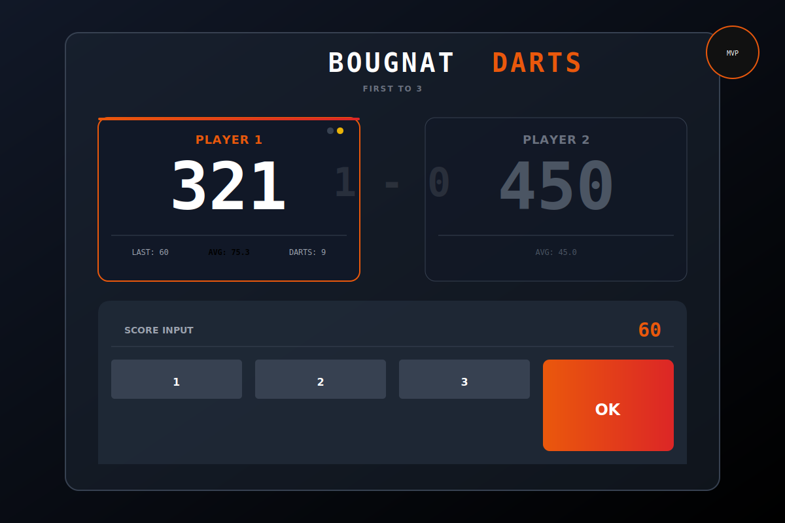

# 🎯 BOUGNAT DARTS


> **The ultimate minimal-click Scorer for traditional steel-tip darts.**  
> *Built for speed. Designed for stats. Optimized for mobile.*

<p align="center">
  
</p>

## 🔥 Why Bougnat Darts?

Most darts apps are cluttered, slow, or ugly. **Bougnat Darts** focuses on the player experience: high contrast for dark environments (pubs/man caves), instant input response, and professional-grade statistics.

### ✨ Key Features

*   **🎯 Complete X01 Engine**: Supports 301, 501, 701, 1001. Configurable In/Out rules (Open, Double, Master).
*   **👥 Advanced Doubles (2v2)**: Dedicated logic for Team games. Select specific "Team Leaders" and toggle which team starts the match.
*   **🎮 Multi-Game Hub**: New scalable architecture ready for X01, Cricket, Clock, Shanghai, and 121 (Coming Soon).
*   **📱 PWA & Mobile First**: Installable on iOS/Android. Works 100% offline. Zero latency.
*   **🔗 Instant Sharing**: Integrated QR Code generator on the home screen to instantly share the app URL with opponents.
*   **🧠 Smart Math**:
    *   **Live Checkout Hints**: Dynamic finishing paths (e.g., "T20 T18 D12" for 138).
    *   **Bust Handling**: Automatic score rollback and validation logic.
*   **📊 Pro-Level Statistics**:
    *   **3-Dart Average** & **First 9 Average**.
    *   **Checkout %**: Tracks doubles hit vs. attempts.
    *   **Scoring Breakdown**: Heatmap of 180s, 140s, 100s, etc.
    *   **Best/Worst Leg** tracking.

---

## 🛠️ Technical Architecture

This project is built with a modern, type-safe stack ensuring maintainability and performance.

### The Stack

| Layer | Technology | Choice Rationale |
| :--- | :--- | :--- |
| **Core** |  | Utilization of latest React 19 features. |
| **Language** |  | Strict typing for game rules and math logic. |
| **Styling** |  | Utility-first CSS for rapid UI development and dark mode. |
| **State** | **Local State / Context** | Zero-dependency state management for instant MVP performance. |
| **Build** | **Vite** | Lightning fast HMR and optimized production builds. |

### Project Structure

The architecture enforces a strict separation between **Game Logic** (Pure TS) and **UI Components** (React).

```bash
src/
├── components/
│   ├── game/       # Game-specific UI (Keypad, ScoreBoard, CheckoutHint)
│   ├── stats/      # Statistical visualizations (Modals, Rows)
│   └── ui/         # Reusable atomic components (Buttons, Cards)
├── utils/
│   └── gameLogic.ts # 🧠 The Brain. Pure functions for scoring, 
│                    # reordering players, undo, and stat calculations.
├── views/          # Page-level route components (Home, GameSelection, Setup, Match)
└── types.ts        # Shared TypeScript interfaces (MatchState, Player, Turn)
```

### Key Logic Implementation

The scoring engine (`gameLogic.ts`) uses an immutable state pattern. Every turn produces a new `MatchState`.

```typescript
// Example: Turn Submission Logic
export const submitTurn = (match: MatchState, score: number, darts: number): MatchState => {
  // 1. Calculate Bust
  const isBust = calculateBust(match.currentScore, score, match.outRule);
  
  // 2. Validate Checkout
  const isCheckout = !isBust && remaining === 0 && isValidDouble(score);

  // 3. Update History (Immutable)
  return {
    ...match,
    history: [...match.history, newTurn],
    stats: recalculateStats(match)
  };
};
```

---

## 🚀 Getting Started

### Prerequisites
*   Node.js v18+
*   npm or yarn

### Installation

1.  **Clone the repository**
    ```bash
    git clone https://github.com/zontave/bougnat-darts.git
    cd bougnat-darts
    ```

2.  **Install dependencies**
    ```bash
    npm install
    ```

3.  **Run Development Server**
    ```bash
    npm run dev
    ```

4.  **Build for Production**
    ```bash
    npm run build
    ```

---

## 🔮 Roadmap

*   [x] **MVP**: Local Quick Play & Stats
*   [x] **Doubles Support**: 2v2 Logic & Starter Selection
*   [x] **Game Selection Hub**: UI for multiple game modes
*   [ ] **Game Modes**: Implement logic for Cricket, Clock, 121.
*   [ ] **Persistence**: Save player profiles and match history (Local Storage/IndexedDB).
*   [ ] **Backend**: Node.js/Postgres API for cloud sync and leaderboards.
*   [ ] **Audio**: Caller sound effects (e.g., "One Hundred and Eighty!").

---

## 👨‍💻 Author

**Zontave**  
*Love IT & Darts*

---

*Made with ❤️ and 🎯 in The Auvergne.*