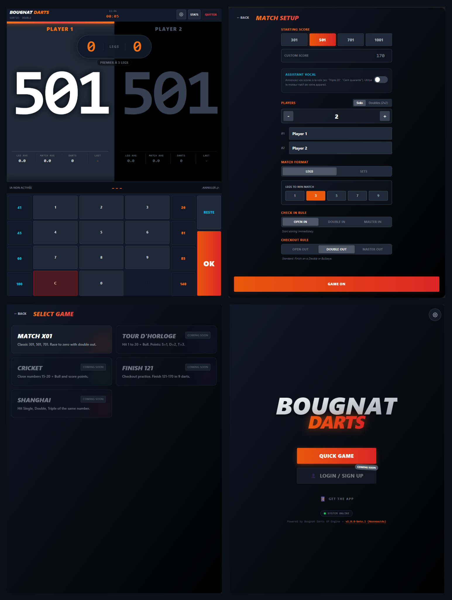

# 🎯 BOUGNAT DARTS


> **The ultimate minimal-click Scorer for traditional steel-tip darts.**  
> *Built for speed. Designed for stats. Connected to the Cloud.*

<p align="center">
  
</p>

## 🔥 Why Bougnat Darts?

Most darts apps are cluttered, slow, or ugly. **Bougnat Darts** focuses on the player experience: high contrast for dark environments (pubs/man caves), instant input response, professional-grade statistics, and cloud synchronization.

### ✨ Key Features

*   **🎯 Professional X01 Engine**:
    *   Supports 301, 501, 701, 1001.
    *   Configurable Rules: **Double In/Out**, Master Out, Open In.
    *   **Match Modes**: Play by **Legs** or **Sets**.
*   **🗣️ Native Voice Control**: 
    *   Hands-free scoring using the **Web Speech API**.
    *   Zero latency, zero model downloads.
    *   Supports complex announcements (e.g., "Triple Vingt", "Bulle", "Miss").
*   **☁️ Cloud Integration (Supabase)**:
    *   **User Profiles**: Create an account to save your progress.
    *   **Match History**: Review past games and results.
    *   **Global Stats**: Track your career Average, Win Rate, and High Scores.
*   **👥 Multiplayer**:
    *   **Solo Mode**: Practice against yourself.
    *   **Doubles (2v2)**: Dedicated UI for team games with player rotation logic.
*   **📱 PWA & Mobile First**: 
    *   Installable on iOS/Android.
    *   Optimized touch targets for mobile play.
    *   "Wake Lock" handling to keep the screen alive during matches.
*   **🧠 Smart Math**:
    *   **Live Checkout Hints**: Dynamic finishing paths (e.g., "T20 T18 D12" for 138).
    *   **Bust Prevention**: Automatic score validation.

---

## 🛠️ Technical Architecture

This project is built with a modern, type-safe stack ensuring maintainability and performance.

### The Stack

| Layer | Technology | Choice Rationale |
| :--- | :--- | :--- |
| **Frontend** |  | Stable component architecture (via ESM). |
| **Language** |  | Strict typing for complex game rules and math logic. |
| **Backend / DB** |  | Auth, Database (PostgreSQL), and Real-time subscriptions. |
| **Voice** | **Web Speech API** | Native browser support for speech recognition (Chrome/Safari/Edge). |
| **Styling** |  | Utility-first CSS (CDN runtime for rapid prototyping). |
| **PWA** | **Service Worker** | Offline capabilities & Installability. |

### Project Structure

The architecture enforces a strict separation between **Game Logic** (Pure TS) and **UI Components** (React).

```bash
src/
├── components/
│   ├── game/       # Game-specific UI (Keypad, ScoreBoard, CheckoutHint)
│   ├── stats/      # Statistical visualizations (Modals, Rows)
│   └── ui/         # Reusable atomic components
├── hooks/
│   └── useSpeechRecognition.ts # 🎤 Handles native microphone streams & lifecycle
├── lib/
│   └── supabase.ts # ☁️ DB connection & API methods
├── utils/
│   ├── gameLogic.ts   # 🧠 The Brain. Pure functions for scoring & stats.
│   └── voiceParser.ts # 🗣️ NLU. Converts "Triple Twenty" -> 60.
├── views/          # Page-level route components (Dashboard, Match, Setup...)
└── types.ts        # Shared TypeScript interfaces
```

## 🔐 Environment Variables

Create a `.env` file at the root of the project:

```env
VITE_SUPABASE_URL=your_project_url
VITE_SUPABASE_ANON_KEY=your_anon_key
```

---

## 📅 Roadmap (v1.0.0-beta.3 & Beyond)

- [ ] **QR Code Stats** (Export des stats de fin de match via QR code vers mobile)
- [ ] **Live Spectateur** (QR Code pour le suivi du match en temps réel/Cast)
- [ ] **Authentification** (Espace Login / Sign-up complet)
- [ ] Online Multiplayer (Real-time)
- [ ] Friends System

---

## 📜 Licensing & Commercial Use

**Proprietary Software - All Rights Reserved**

*   **Free for Personal Use:** Individual players may use the application freely for personal training and games.
*   **Commercial Use Restricted:** Use in commercial environments (Bars, Darts Clubs, Leagues, Tournaments) requires a valid commercial license.

For licensing inquiries, please contact the author.

---

## 👨‍💻 Author

**Zontave**  
*Love IT & Darts*

---

*Made with ❤️ and 🎯 in The Auvergne.*
