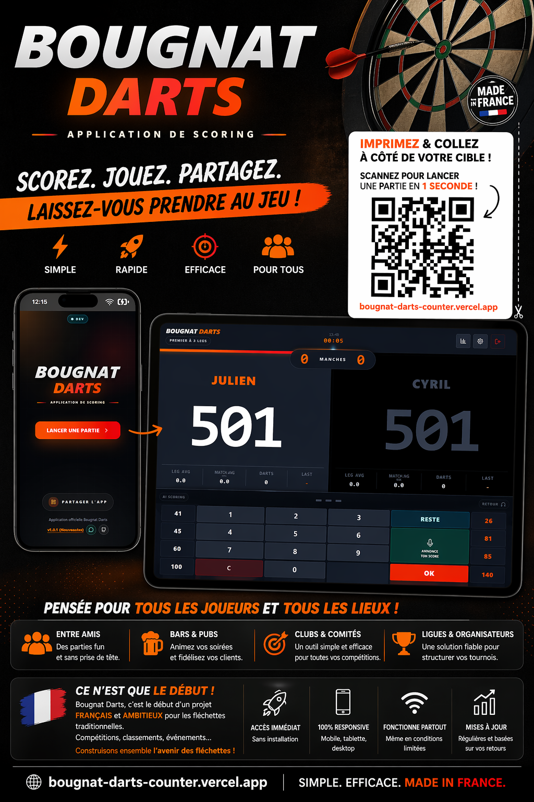

# Bougnat Darts Counter

**L'application qui met l'ambiance autour de la cible.**

Scorez une partie en quelques secondes, sans compte, sans installation, sans prise de tête.

Bougnat Darts Counter transforme un téléphone, une tablette ou un écran de bar en compteur de fléchettes clair, rapide et prêt pour le terrain.

🇫🇷 **Francais** · 🎯 **Gratuit** · 🚫 **Sans pub**

👉 [Lancer une partie maintenant](https://play.bougnatdarts.fr)

## 🎯 Scorez. Jouez. Partagez.

Bougnat Darts Counter est pensé pour les vraies soirées fléchettes : celles où l’on veut jouer vite, voir les scores de loin, chambrer un peu, relancer une manche et garder tout le monde dans le match.

- ⚡ **1 lien, 1 QR code, 1 partie**
- 🔓 **Aucun compte obligatoire**
- 📱 **Mobile, tablette, desktop**
- 👀 **Lisible près de la cible**
- 🤝 **Simple pour les débutants**
- 🏆 **Solide pour les habitués**

## 🚀 Le compteur qui va partout

**🏠 A la maison**

Posez le telephone a cote de la cible, choisissez le jeu, et c'est parti.

**🍻 Dans un bar ou un pub**

Affichez le QR code, laissez les joueurs lancer leurs parties, animez vos soirees sans sortir le carnet et le stylo.

**🎽 En club**

Gagnez du temps sur les entrainements, les rencontres amicales et les petites competitions.

**🏆 Pour les organisateurs**

Une base simple et efficace pour structurer le scoring, accueillir les joueurs et rendre les parties plus lisibles.

## 🎲 Les jeux disponibles

- 🎯 **X01** (501, 301, 701 — Legs ou Sets, Simple / Double Out, bot IA)
- 🏏 **Cricket**
- 👑 **Capital**
- 🏅 **Triathlon**
- 💀 **Killer**
- 🔄 **Gotcha**

Le score manuel reste toujours disponible. L’assistance vocale peut accompagner le X01 quand elle est activée, mais le jeu ne dépend jamais du micro.

## ✅ Statut de la base `v1.1.1`

`Bougnat_darts_counter` est aligné pour la release open source stable `v1.1.1`, centrée sur :

- le moteur de scoring
- les jeux de fléchettes supportés
- le voice scoring `X01` optionnel
- les sessions locales
- la reprise locale
- l’expérience offline-first

Le runtime supporté en `v1.1.1` ne dépend d’aucun backend métier obligatoire.

## 🚫 Hors perimetre explicite

Ce repo ne contient pas :

- authentification metier avancee
- profils distants persistés
- statistiques cloud consolidees
- logique tournoi
- persistance backend metier
- couplage proprietaire obligatoire avec `Bougnat_Darts_Tournaments`

Les integrations externes eventuelles doivent rester contractuelles et optionnelles, sans casser le gameplay local.

## 🔌 Separation avec `Bougnat_Darts_Tournaments`

`Bougnat_darts_counter` porte le scorage open source et l experience de jeu locale.

`Bougnat_Darts_Tournaments` est le systeme maitre metier reserve a l orchestration tournoi, aux donnees proprietaires et aux integrations backend explicites.

La frontiere `v1.1.1` impose qu aucune logique proprietaire ne soit necessaire pour lancer, scorer, corriger, annuler, terminer et reprendre localement une partie.

## ❤️ Pourquoi les joueurs l'aiment

**⚡ Ca demarre vite**

On ouvre, on choisit, on joue. Pas de tunnel inutile.

**👀 C'est clair**

Gros scores, actions visibles, interface pensee pour rester concentre sur la partie.

**📱 Ca marche sur le materiel deja la**

Telephone, tablette, ordinateur, ecran de comptoir : chacun utilise ce qu'il a sous la main.

**🤝 C'est fait pour etre partage**

Un QR code pres de la cible, et tout le monde peut lancer une partie.

## 🖨️ Kit terrain

1. Imprimez l'affiche.
2. Collez-la pres de votre cible.
3. Scannez le QR code.
4. Lancez une partie.
5. Faites vivre la soiree.

Le lien a partager : **https://play.bougnatdarts.fr**

## 🇫🇷 Made in France, gratuit, sans pub

Bougnat Darts est un projet français né autour d’une idée simple : rendre le scoring plus accessible, plus fun et plus propre pour tous les lieux où l’on joue aux fléchettes.

L’application est **gratuite** et **sans publicité** : on vient pour jouer, pas pour fermer des pop-ups.

Ce n'est que le debut. Les retours des joueurs, des bars, des clubs et des organisateurs aident directement a construire la suite.

## 🙌 Rejoindre l'aventure

- 🎯 Testez l'application pendant une vraie partie.
- 📣 Partagez le lien avec vos joueurs.
- 🖨️ Imprimez l'affiche pour votre lieu.
- 💬 Remontez vos idees, vos irritants et vos envies.

Chaque retour terrain compte.

## 📚 Infos utiles

- [Guide technique et developpement](docs/technical.md)
- [Architecture cible](docs/architecture.md)
- [Perimetre produit](docs/product-scope.md)
- [Securite](SECURITY.md)
- [Contribuer](CONTRIBUTING.md)
- [Notes de version v1.1.1](docs/release/v1.1.1.md)
- [Coverage map v1.1.1](docs/release/v1.1.1-coverage-map.md)
- [Notes de version v1.1](docs/release/v1.1.md)
- [Coverage map v1.1](docs/release/v1.1-coverage-map.md)
- [Notes de version v1.0.2](docs/release/v1.0.2.md)

## 📄 Licence

Bougnat Darts Counter est distribue sous licence MIT.
