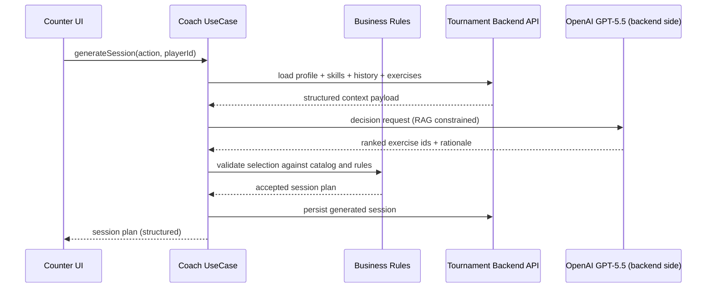

# Spec 029 - counter ai coach progression

## Meta

- ID: `029-counter-ai-coach-progression`
- Slug: `spec:counter/ai-coach-progression`
- Statut: `active`
- Milestone cible: `M11: AI Coach Foundation`

## Vision

Faire de Bougnat Darts une plateforme de progression intelligente ou le scoring devient un module d execution.

Le Coach IA n est pas un chatbot.

Le joueur ne saisit jamais de texte libre et ne discute jamais avec l IA.

Le Coach IA opere en arriere-plan pour analyser, planifier, composer et adapter les entrainements.

## Functional Specification

### Parcours home Coach

L ecran d accueil du Coach expose uniquement ces 4 actions:

- Continuer mon programme de progression (recommande)
- Travailler une competence
- Preparer une competition
- Faire une evaluation complete

Contraintes UX:

- zero chat
- zero saisie libre
- parcours ultra court

### Evaluation initiale

Le premier usage Coach declenche une batterie de tests couvrant:

- scoring
- T20
- T19
- bull
- doubles
- checkouts
- cricket
- regularite
- precision
- pression

Les scores alimentent le Skill Model persiste backend.

### Seances libres

Le mode seance libre propose des themes predefinis:

- doubles
- scoring
- bull
- cricket
- checkouts
- match
- pression
- echauffement
- aleatoire

Chaque generation selectionne uniquement des exercices existants du catalogue.

## Domain Specification

### Skill Model (extensible)

Competences de base:

- Scoring
- Triple20
- Triple19
- Bull
- Doubles
- Checkouts <40
- Checkouts 41-60
- Checkouts 61-80
- Checkouts 81-100
- Checkouts 100+
- Cricket
- Regularite
- GestionPression
- PremierTour
- Endurance
- Concentration

Modele attendu par competence:

- score courant
- confiance de mesure
- tendance
- fenetre d observation
- date de mise a jour

### Catalogue d exercices

Chaque exercice est une entite data-driven:

- id
- nom
- description
- duree
- difficulte
- objectif
- competences principales
- competences secondaires
- prerequis
- materiel
- niveau conseille
- criteres de reussite
- criteres d echec
- tags
- parametres configurables

Invariant: le modele IA ne cree jamais d exercice.

## Use Cases

- UC1: Demarrer Coach Home et choisir un des 4 parcours
- UC2: Lancer evaluation initiale
- UC3: Generer programme de progression par cycles
- UC4: Generer une seance ponctuelle orientee objectif
- UC5: Reevaluer apres variation majeure de performance
- UC6: Adapter le programme apres execution de seance

## User Stories

- En tant que joueur, je veux reprendre mon programme en un clic pour ne pas perdre de temps.
- En tant que joueur, je veux travailler une competence precise sans config manuelle complexe.
- En tant que joueur, je veux un plan competition progressif et realiste.
- En tant que joueur, je veux une evaluation complete initiale pour obtenir un point de depart fiable.

## Sequence Diagrams

## ADR

- ADR-029-001: IA en aide a la decision uniquement, jamais moteur metier.
- ADR-029-002: selection d exercices bornee strictement au catalogue backend.
- ADR-029-003: appels IA limites aux moments a forte valeur (evaluation, programme, generation seance, reevaluation majeure).
- ADR-029-004: architecture RAG + prompt engineering avec garde-fous de validation metier.

## API Contracts

Endpoints frontend->backend proposes (versionnes):

- `GET /v1/coach/me/profile`
- `GET /v1/coach/me/skills`
- `GET /v1/coach/exercises`
- `GET /v1/coach/me/executions?limit=50`
- `POST /v1/coach/me/evaluations`
- `POST /v1/coach/me/programs:generate`
- `POST /v1/coach/me/sessions:generate`
- `POST /v1/coach/me/sessions`

Regles contrat:

- payloads types
- enveloppe d erreur standardisee
- idempotency key pour generation/persistance
- auth via session backend existante

## Database Model

Entites cibles cote backend Tournament:

- PlayerSkill
- PlayerAssessment
- TrainingProgram
- TrainingCycle
- TrainingSession
- Exercise
- ExerciseCategory
- ExerciseExecution
- PlayerProgress
- SkillEvolution
- TrainingRecommendation
- CoachConfiguration
- TrainingGoal

Contraintes:

- schema normalise
- relations explicites
- zero redondance metier
- migrations versionnees

## Domain Events

- `coach.assessment.completed`
- `coach.program.generated`
- `coach.session.generated`
- `coach.session.executed`
- `coach.progress.recomputed`
- `coach.reevaluation.required`

## Error Handling

Codes metier minimum:

- `coach_profile_not_found`
- `exercise_catalog_unavailable`
- `coach_context_incomplete`
- `ai_decision_invalid`
- `session_generation_conflict`
- `session_persist_failed`
- `unauthorized`

Politique:

- fallback deterministic si IA indisponible
- aucune proposition IA non validee par les regles metier
- messages utilisateur courts, non techniques

## Acceptance Criteria

- AC1: le Coach Home affiche exactement les 4 actions cibles.
- AC2: aucune vue Coach ne propose de chat ni champ texte libre.
- AC3: une seance generee ne contient que des exercices du catalogue API.
- AC4: les choix IA sont validates par le moteur metier avant affichage.
- AC5: le scoring existant reste intact (pas de regression).
- AC6: les appels IA sont limites aux points de decision definis.

## Tests

- Unit tests domaine: priorisation competences, validation catalogue, contraintes seance
- Unit tests application: orchestration CoachAIService, cache, gestion erreurs
- Integration tests: adapters API Coach + contrats
- Non regression tests: flux scoring X01/Cricket/Capital/Killer/Gotcha/Triathlon
- E2E smoke: Home -> Coach -> choix parcours -> generation -> execution

## Prompt System

System prompt backend attendu:

- role: entraineur professionnel de flechettes
- interdit: inventer un exercice, sortir du catalogue, ignorer contraintes
- obligatoire: progression pedagogique, equilibre difficulte/motivation/recuperation
- sortie: JSON strict, structure directement exploitable par l application
