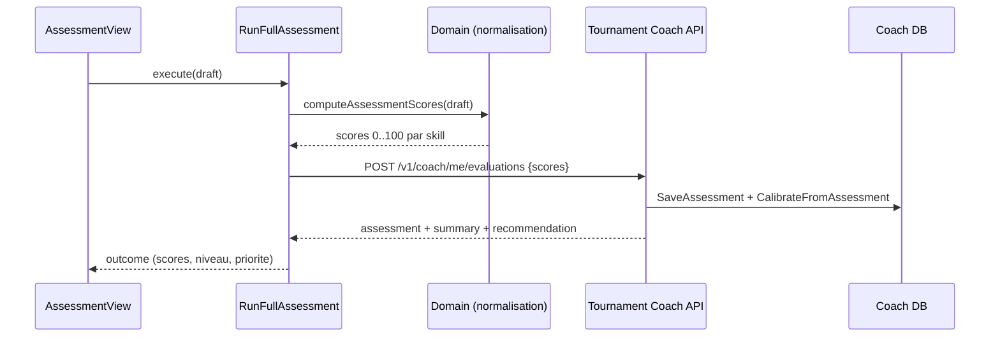

# Spec 030 - counter coach full assessment

## Meta

- ID: `030-counter-coach-full-assessment`
- Slug: `spec:counter/coach-full-assessment`
- Statut: `active`
- Milestone cible: `M11: AI Coach Foundation`
- Depend de: `029-counter-ai-coach-progression`, `044-bdt-coach-ai-progression-backend`

## Vision

Le parcours "Faire une evaluation complete" mesure objectivement le niveau du
joueur en flechettes traditionnelles (501 double-out) puis recalibre son profil
Coach (niveau, objectif prioritaire, competences).

Contrainte materielle: aucune camera ni capteur. Toute mesure repose sur des
comptages saisis au pave (aucune saisie de texte libre, aucun chat).

## Functional Specification

### Batterie d evaluation (100% comptage)

Enchainement standardise, ~18-20 min echauffement inclus:

1. Scoring sur la 20: 6 volees de 3 flechettes -> `scoring` + `consistency`
2. Trebles 20: 30 flechettes -> `treble_hitting`
3. Tour des doubles D1..D20 -> `doubles`
4. Bull: 21 flechettes (25 et 50 comptes separement) -> `bull`
5. Checkouts imposes 61/81/100/121 -> `checkout`
6. Leg 301 double-out, une tentative -> `pressure` (moins de flechettes = mieux)

### Regularite sans camera

La competence `consistency` est derivee de la variance des 6 volees de scoring:
un joueur regulier (60/60/57/60) score mieux qu un joueur disperse (100/20/80/37)
a moyenne egale. Aucune mesure spatiale n est requise.

### Sortie

- scores 0..100 par competence
- score global (moyenne)
- niveau derive (debutant < 40, intermediaire 40-70, avance > 70)
- competence la plus faible = priorite recommandee
- recommandation textuelle issue du backend (deterministic fallback ou IA)

## Domain Specification

### Taxonomie mesurable (7 skill_code)

- `scoring`
- `treble_hitting`
- `doubles`
- `bull`
- `checkout`
- `consistency` (derivee de la variance)
- `pressure`

Competence retiree volontairement: `setup` (mecanique/rythme) car non mesurable
sans observation.

### Normalisation

Chaque comptage brut est converti en 0..100 par interpolation lineaire par
paliers (baremes niveau loisir, ajustables). Sortie directement consommable par
`POST /v1/coach/me/evaluations` (`scores: map[string]float64`).

### Calibration (backend)

A la reception de l evaluation, le backend:

- persiste l evaluation (`coach_player_assessments`)
- upsert des competences mesurees (`coach_player_skills`, confiance mesuree)
- trace l evolution (`coach_skill_evolution`)
- met a jour niveau + objectif prioritaire (`coach_player_progress`)

Le backend reste le moteur decisionnel unique: niveau et objectif sont derives
cote serveur (`DeriveLevel`, `DerivePrimaryObjective`).

## Use Cases

- UC1: lancer l evaluation depuis Coach Home ("Faire une evaluation complete")
- UC2: saisir les comptages test par test (steppers, sans texte libre)
- UC3: soumettre l evaluation et recevoir le profil recalibre
- UC4: consulter forces/faiblesses et la priorite recommandee
- UC5: refaire l evaluation

## User Stories

- En tant que joueur, je veux une mesure fiable de mon niveau sans materiel special.
- En tant que joueur, je veux comprendre ma competence la plus faible a travailler.
- En tant que joueur, je veux que mon profil Coach soit recalibre automatiquement.

## Sequence Diagram

## ADR

- ADR-030-001: aucune mesure spatiale; comptages uniquement (pas de camera).
- ADR-030-002: `consistency` derivee de la variance des volees de scoring.
- ADR-030-003: normalisation brut->0..100 cote frontend (mesure produit), decision
  niveau/objectif cote backend (moteur decisionnel unique).
- ADR-030-004: contrat `POST /v1/coach/me/evaluations` inchange (`scores` map).

## API Contracts

- `POST /v1/coach/me/evaluations` (inchange)
  - request: `{ "scores": { "<skill_code>": number } }`
  - response: `Assessment { id, scores, summary, completedAt }`
  - `summary.recommendation` obligatoire (garde-fou backend)

## Database Model

Tables impactees a la calibration:

- `coach_player_assessments` (deja)
- `coach_player_skills` (upsert score/confidence/trend)
- `coach_skill_evolution` (delta previous/current)
- `coach_player_progress` (level + primary_objective)

## Domain Events

- `coach.assessment.completed`
- `coach.progress.recomputed`

## Test Strategy

- unit domaine frontend: batterie, normalisation, variance/consistency, derivations
- unit application frontend: `RunFullAssessment`
- unit infrastructure frontend: `HttpCoachAssessmentClient`
- unit domaine backend: `DeriveLevel`, `DerivePrimaryObjective`, `CalibrateFromAssessment`
- integration backend existante: endpoint evaluations (deterministic + IA)
