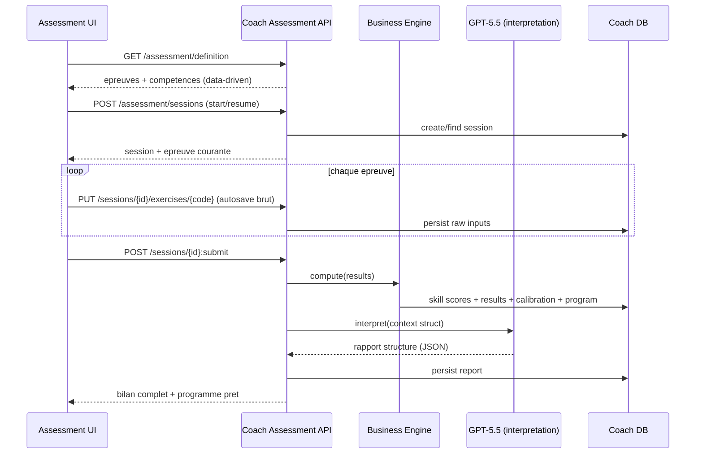

# Spec 031 - counter coach assessment premium

## Meta

- ID: `031-counter-coach-assessment-premium`
- Slug: `spec:counter/coach-assessment-premium`
- Statut: `draft`
- Milestone cible: `M11: AI Coach Foundation`
- Remplace / etend: `030-counter-coach-full-assessment`
- Backend associe: `045-bdt-coach-assessment-engine` (repo Bougnat_Darts_Tournaments)
- Livrables de cette spec: `spec.md`, `adr.md`, `data-model.md`, `api-contracts.md`,
  `domain-events.md`, `use-cases.md`, `acceptance-tests.md`, `plan.md`, `tasks.md`

## Vision

L Evaluation complete est le point d entree du moteur de progression du Coach IA.

Ce n est pas un enchainement d exercices: c est un veritable **bilan de competences**.

A l issue de l evaluation, le systeme determine le niveau global, le profil
technique, les forces, les faiblesses, les axes prioritaires, les competences
limitantes, le potentiel de progression, et genere automatiquement le programme
d entrainement le plus adapte.

Le score moyen n est qu un indicateur parmi beaucoup d autres.

## Principes directeurs (invariants)

- Le **moteur metier backend** est l unique autorite de calcul (voir ADR-031-001).
- Les epreuves, competences et baremes sont **data-driven** et versionnes (ADR-031-002).
- Aucune logique metier dans l UI; le frontend capture des entrees brutes et rend des resultats.
- Aucune donnee mockee, aucune donnee codee en dur, aucun stockage local.
- Toutes les donnees proviennent des API backend Bougnat Darts Tournament.
- L authentification, les utilisateurs et la base existants ne sont jamais recrees.
- L IA interprete uniquement; elle ne calcule ni n invente aucune donnee (ADR-031-004).

## Functional Specification

### Ecran d introduction

Affiche, charge depuis l API de definition:

- titre
- description
- duree estimee totale
- nombre d epreuves
- materiel necessaire
- indication de reprise si une session est en cours
- bouton `Commencer l evaluation` (ou `Reprendre` si session in_progress)

### Deroule de l evaluation

Pendant toute l evaluation, en permanence:

- barre de progression (epreuve courante / total)
- prochaine etape annoncee
- temps estime restant (derive des durees des epreuves restantes)
- bouton `Mettre en pause`
- sauvegarde automatique apres chaque epreuve (persistee serveur)

Chaque epreuve:

- consignes claires (protocole, cible, nombre de flechettes)
- saisie des entrees brutes uniquement (steppers / comptages, zero texte libre)
- validation d epreuve = autosave serveur + passage a la suivante
- reprise possible a l epreuve exacte apres interruption

### Finalisation

A la soumission finale:

1. Le moteur metier backend calcule scores, indicateurs, tendances, priorites, potentiel.
2. La calibration met a jour le profil (competences, niveau, objectif).
3. Le moteur genere le programme personnalise (niveau, competences prioritaires,
   objectifs, duree, premier cycle, premiere seance).
4. L IA produit un rapport pedagogique structure (interpretation uniquement).

### Ecran de bilan final

Affiche un veritable bilan (pas seulement des statistiques):

- radar de competences
- score global
- details par competence (score + indicateurs)
- evolution (si historique disponible)
- analyse IA (resume pedagogique, forces, faiblesses, priorites, explication)
- estimation du potentiel de progression
- objectif recommande
- bloc `Votre programme personnalise est pret`
- bouton `Commencer ma progression`

## Domain Specification

### Referentiel de competences (14, extensible)

| skill_code | Libelle | Categorie |
|---|---|---|
| `scoring` | Scoring | offense |
| `treble_20` | Triple 20 | offense |
| `treble_19` | Triple 19 | offense |
| `bull` | Bull | precision |
| `doubles` | Doubles | finition |
| `checkout` | Checkouts | finition |
| `cricket` | Cricket | strategie |
| `consistency` | Regularite | mental |
| `pressure` | Pression | mental |
| `endurance` | Endurance | physique |
| `concentration` | Concentration | mental |
| `rhythm_control` | Gestion du rythme | mental |
| `first_nine` | Premier passage | offense |
| `finishing` | Finish | finition |

Chaque competence evolue independamment (score, confiance, tendance, fenetre d observation).
Le referentiel est stocke en base (data-driven), extensible sans modification de code metier.

### Moteur d evaluation modulaire

- Chaque epreuve est une entite independante et configurable.
- Chaque epreuve mesure une ou plusieurs competences (ponderations configurables).
- L ordre des epreuves est une donnee de configuration (evolue sans code metier).
- Chaque epreuve declare un schema d entrees brutes (`input_schema`) et une
  configuration de scoring (`scoring_config`) interpretee par le moteur.

### Les 10 epreuves (minimum)

| code | Epreuve | Entrees brutes principales | Indicateurs calcules | Competences |
|---|---|---|---|---|
| `scoring_501` | Scoring | scores de N volees | moyenne, ecart-type, best/worst, distribution, nb 100+/140+/180 | scoring, consistency, first_nine |
| `treble_20` | Triple 20 | touches/essais, zones | precision, taux de reussite, dispersion | treble_20 |
| `treble_19` | Triple 19 | touches/essais, zones | precision, taux de reussite, dispersion | treble_19 |
| `bull` | Bull | nb 25, nb 50, essais | precision, ratio double bull | bull |
| `doubles_tour` | Doubles | reussite par double, flechettes utilisees | efficacite, flechettes/double, favoris, problematiques | doubles, finishing |
| `checkouts` | Checkouts | reussite/essais par plage | reussite par plage, efficacite globale | checkout, finishing |
| `cricket` | Cricket | fermetures, points, tours | fermeture, scoring, strategie, regularite | cricket |
| `regularity` | Regularite | series de scores | stabilite, coefficient de variation | consistency, concentration |
| `endurance` | Endurance | scores debut/milieu/fin | delta de performance, detection de baisse | endurance, rhythm_control |
| `pressure` | Pression | reussite sur situations cle, repetitions | reussite, repetabilite, stabilite | pressure, concentration |

### Sorties du moteur metier

- `skillScores`: score 0..100 + confiance + indicateurs par competence
- `overallScore`: indicateur agrege (pondere, non simple moyenne)
- `level`: niveau global derive
- `priorities`: competences limitantes ordonnees
- `potential`: estimation du potentiel de progression (marge par competence)
- `trends`: tendances vs historique (si disponible)

## Use Cases

Voir `use-cases.md` (UC1..UC10).

## User Stories

- En tant que joueur, je veux comprendre precisement mon niveau reel, pas juste une moyenne.
- En tant que joueur, je veux pouvoir mettre en pause et reprendre mon evaluation plus tard.
- En tant que joueur, je veux un bilan clair (radar, forces, faiblesses, potentiel).
- En tant que joueur, je veux qu un programme adapte soit pret a la fin de l evaluation.
- En tant que produit, je veux ajouter/retirer une epreuve sans redeployer de code metier.

## Sequence Diagram (vue d ensemble)

## ADR

Voir `adr.md` (ADR-031-001 a ADR-031-008).

## API Contracts

Voir `api-contracts.md`.

## Database Model

Voir `data-model.md`.

## Domain Events

Voir `domain-events.md`.

## Acceptance Criteria

Voir `acceptance-tests.md`.

## Test Strategy

- unit domaine backend: moteur de scoring par epreuve, agregation, potentiel, priorites
- unit domaine backend: derivation niveau/objectif, calibration, tendances
- unit backend: validation du rapport IA (schema strict, anti-invention)
- integration backend: cycle de vie session (start/resume/autosave/pause/submit), idempotency
- integration SQL: migrations nouvelles tables + CRUD
- unit frontend: rendu radar, mapping resultats, aucune logique metier
- integration frontend: parcours, reprise apres interruption, temps restant
- non-regression: suite scoring existante inchangee (aucune regression)
- tests d acceptation: scenarios Gherkin `acceptance-tests.md`

## Contraintes de non-regression

- L application de scoring existante n est pas impactee.
- Le contrat `POST /v1/coach/me/evaluations` (spec 030) reste disponible en
  compatibilite (deprecie) le temps de la migration (voir ADR-031-006).
